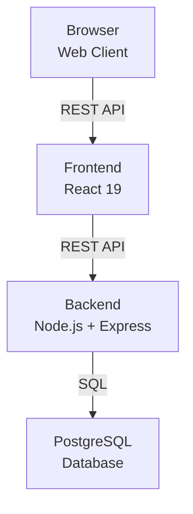
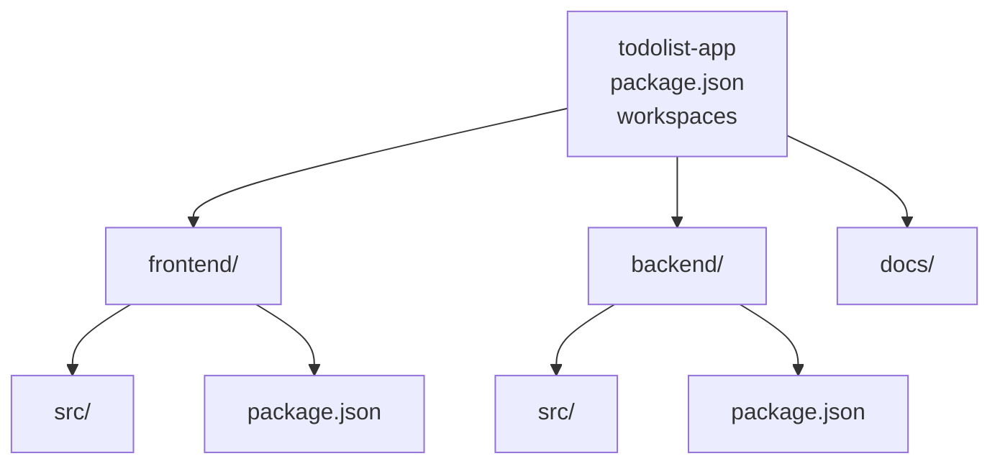
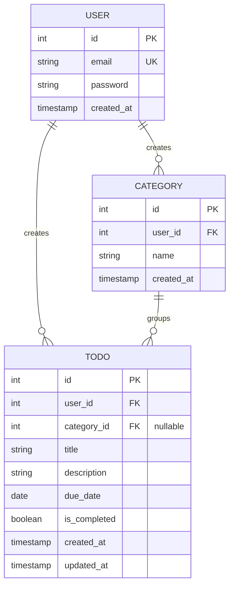
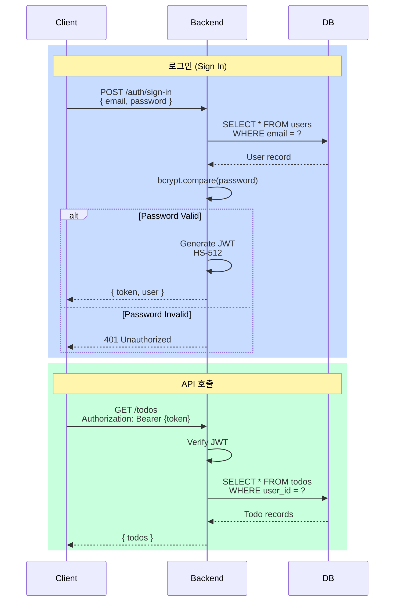

# 아키텍처 다이어그램

**변경이력**

| 버전 | 날짜 | 작성자 | 내용 |
|------|------|--------|------|
| 1.0.0 | 2026-04-28 | 최훈진 | 초판 작성 |

---

## 개요

이 문서는 Todo 리스트 애플리케이션의 시스템 아키텍처, 모노레포 구조, 도메인 모델, 그리고 인증 흐름을 시각화합니다.  
자세한 내용은 [PRD](./2-prd.md)와 [프로젝트 구조 설계 원칙](./4-project-structure.md)을 참고하세요.

---

## 1. 시스템 아키텍처

**설명**: 브라우저에서 데이터베이스까지의 3-tier 아키텍처로, 요청과 응답이 각 계층을 통과합니다.

---

## 2. 모노레포 구조

**설명**: npm workspaces로 관리되는 모노레포의 디렉토리 계층 구조입니다.

---

## 3. 도메인 모델 (ERD)

**설명**: 사용자, 카테고리, 할일의 관계를 표현하는 엔티티 관계도입니다.

---

## 4. 인증 흐름

**설명**: 로그인 후 JWT 토큰 발급 및 이후 API 호출 시 토큰 검증 과정입니다.

---

## 관련 문서

- [PRD](./2-prd.md) — 제품 요구사항 정의
- [프로젝트 구조 설계 원칙](./4-project-structure.md) — 레이어별 책임과 구조
