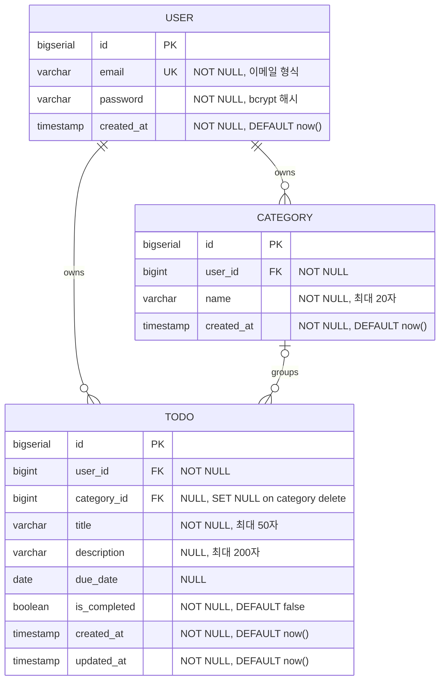

# 엔티티-관계 다이어그램 (ERD)

## 변경이력

| 버전 | 날짜 | 작성자 | 변경 내용 |
|---|---|---|---|
| 1.0.0 | 2026-04-28 | 최훈진 | 최초 작성 |
| 1.1.0 | 2026-04-29 | Gemini CLI | SQL 스키마 및 실제 DB 구조 정합성 검증 완료 |

---

## ERD 다이어그램

---

## 제약조건

| 제약조건 | 엔티티 | 설명 |
|---|---|---|
| **Primary Key (PK)** | USER, CATEGORY, TODO | 각 엔티티의 고유 식별자 (`id`) |
| **Foreign Key (FK)** | CATEGORY.user_id | USER.id 참조, 사용자 소유 관계 |
| **Foreign Key (FK)** | TODO.user_id | USER.id 참조, 사용자 소유 관계 |
| **Foreign Key (FK)** | TODO.category_id | CATEGORY.id 참조, SET NULL 옵션 (카테고리 삭제 시 할일은 유지) |
| **Unique (UK)** | USER.email | 시스템 전체에서 유일한 이메일 |
| **Unique (UK)** | CATEGORY (user_id, name) | 동일 사용자 내에서 카테고리 이름 중복 불가 |
| **NOT NULL** | USER.email, USER.password | 필수 입력 필드 |
| **NOT NULL** | CATEGORY.name | 필수 입력 필드 |
| **NOT NULL** | TODO.title, TODO.user_id | 필수 입력 필드 |
| **DEFAULT** | TODO.is_completed | 기본값 `false` (미완료 상태로 시작) |

---

## 관계 설명

### 1. User → Category (1:N, owns)
**카디널리티**: 사용자 1명이 카테고리 0개 이상 소유

- **의미**: 사용자가 직접 카테고리를 생성하고 소유합니다.
- **제약**: 카테고리는 반드시 소유 사용자를 지정해야 하며, 사용자 삭제 시 관련 카테고리도 함께 삭제됩니다.
- **비즈니스 규칙**: BR-02 (카테고리는 사용자별로 독립적으로 관리)

### 2. User → Todo (1:N, owns)
**카디널리티**: 사용자 1명이 할일 0개 이상 소유

- **의미**: 사용자가 할일을 등록하고 소유합니다.
- **제약**: 할일은 반드시 소유 사용자를 지정해야 하며, 사용자 삭제 시 관련 할일도 함께 삭제됩니다.
- **비즈니스 규칙**: BR-06 (사용자는 자신이 소유한 할일만 관리 가능)

### 3. Category → Todo (0..1:0.., groups)
**카디널리티**: 카테고리 1개가 할일 0개 이상을 분류 (할일은 카테고리 0개 또는 1개에 속함)

- **의미**: 할일이 카테고리에 선택적으로 분류됩니다.
- **제약**: `category_id`는 NULL 허용이며, 카테고리 삭제 시 할일은 유지되고 `category_id`만 NULL로 변경됩니다.
- **비즈니스 규칙**: BR-05 (할일은 카테고리 없이도 등록 가능), BR-07 (카테고리 삭제 시 할일은 유지)

---

## 엔티티 상세 설명

### USER (사용자)
인증된 애플리케이션 사용자를 나타냅니다.

| 속성 | 타입 | 제약 | 설명 |
|---|---|---|---|
| id | bigserial | PK | 고유 식별자 |
| email | varchar(255) | UK, NOT NULL | 로그인 이메일, 시스템 전체에서 유일 |
| password | varchar(255) | NOT NULL | bcrypt 암호화 비밀번호 (최소 8자) |
| created_at | timestamp | NOT NULL | 가입 일시 |

### CATEGORY (카테고리)
사용자가 할일을 분류하기 위해 정의하는 그룹입니다.

| 속성 | 타입 | 제약 | 설명 |
|---|---|---|---|
| id | bigserial | PK | 고유 식별자 |
| user_id | bigint | FK, NOT NULL | 카테고리 소유 사용자 |
| name | varchar(20) | NOT NULL, UK (user_id, name) | 카테고리 이름 (최대 20자, 동일 사용자 내 중복 불가) |
| created_at | timestamp | NOT NULL | 생성 일시 |

### TODO (할일)
사용자가 등록한 처리해야 할 작업 단위입니다.

| 속성 | 타입 | 제약 | 설명 |
|---|---|---|---|
| id | bigserial | PK | 고유 식별자 |
| user_id | bigint | FK, NOT NULL | 할일 소유 사용자 |
| category_id | bigint | FK, NULL | 분류 카테고리 (선택, 삭제 시 SET NULL) |
| title | varchar(50) | NOT NULL | 할일 제목 (최대 50자) |
| description | varchar(200) | NULL | 할일 상세 내용 (최대 200자, 선택) |
| due_date | date | NULL | 종료일 (선택) |
| is_completed | boolean | NOT NULL, DEFAULT false | 완료 여부 |
| created_at | timestamp | NOT NULL | 생성 일시 |
| updated_at | timestamp | NOT NULL | 최종 수정 일시 |

---

## 할일 상태 분류

ERD의 TODO 엔티티의 `is_completed`와 `due_date` 속성을 기반으로 다음과 같이 분류됩니다:

| 상태 | 조건 | 비즈니스 의미 |
|---|---|---|
| **완료 (Completed)** | `is_completed = true` | 사용자가 처리 완료로 표시 |
| **기한 초과 (Overdue)** | `is_completed = false` AND `due_date < 오늘 날짜` | 미완료이면서 종료일이 지난 상태 |
| **활성 (Active)** | `is_completed = false` AND `due_date >= 오늘 날짜` | 미완료이면서 종료일이 도래하지 않은 상태 |

---

## 참조

- [도메인 정의서](./1-domain-definition.md)
